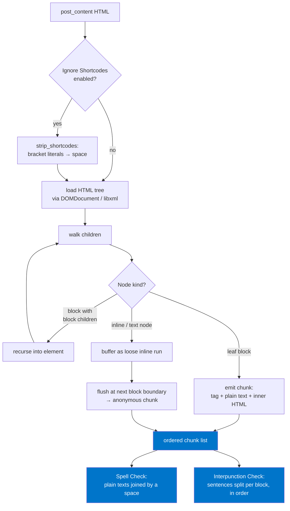
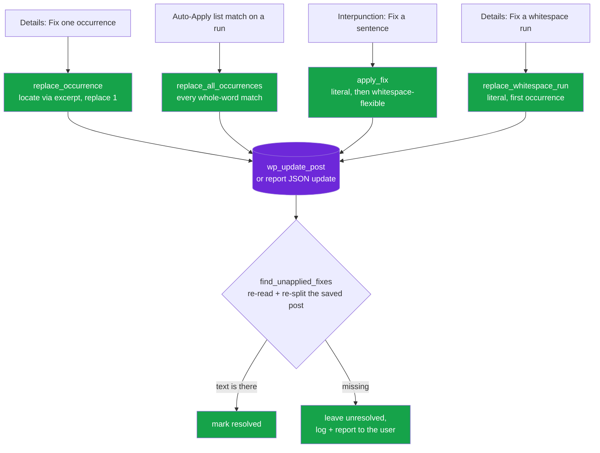
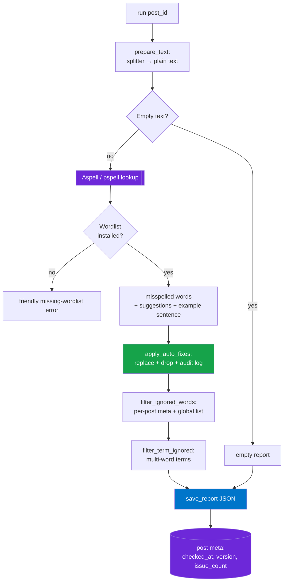
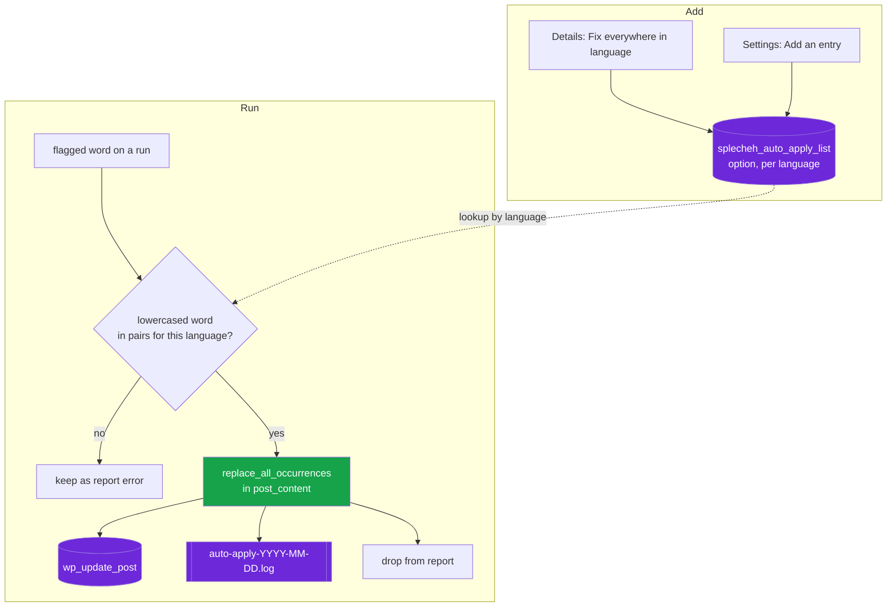
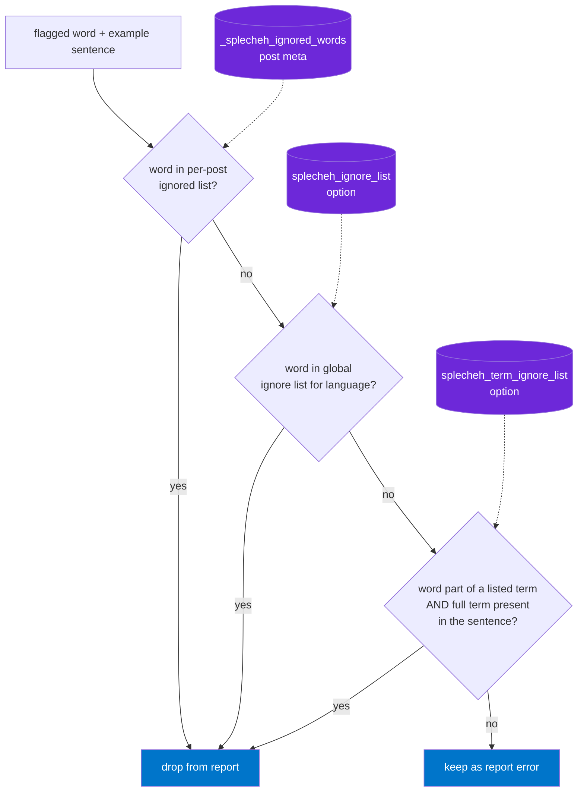
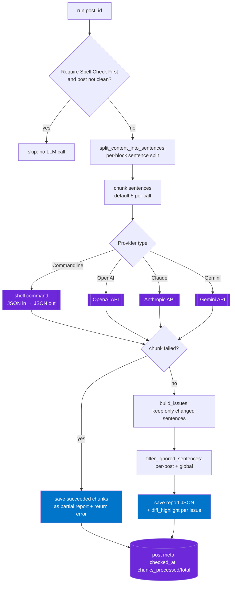

# Splecheh — WordPress Spellcheck Plugin

## What is it?
A WordPress plugin that runs spell checks across all articles and post types to surface spelling errors in a single view.

## Who's it for?
Editors and content managers who need to maintain writing quality across a WordPress site without reviewing each post individually.

## What it does
- Scans all posts and custom post types for spelling errors.
- Flags double spaces (runs of 2+ spaces/tabs between words) in the same pass — invisible in the rendered page, but noise in the source.
- Lists all spellcheck issues in a central admin view.
- Admin menu accessible to editors (and above).
- Optional Interpunction Check: uses an LLM to fix punctuation and capitalization, sentence by sentence (see below).

## How It Works

This section diagrams how each feature actually behaves in code. Node colors follow the project convention: **external systems / persistence** (Aspell, LLM providers, WordPress storage) are purple, **content-modifying actions** are green, and **report / output artifacts** are blue.

### Text Splitting (`Splecheh_ContentSplitter`)

Both checks start from the same tree-based split so text is never merged across a block boundary (issue #62). Each block-level element (`h1`–`h6`, `p`, `li`, `blockquote`, `td`/`th`, `div`, `pre`, `figcaption`, …) becomes one **chunk** carrying both its plain text (for spell check / sentence splitting) and its inner HTML (so inline `<strong>`/`<em>`/`<a>` formatting is preserved). A container that itself holds block children is recursed into; loose inline/text between blocks is flushed into its own anonymous chunk.



### Writing Fixes Back

A fix always edits the raw `post_content` — inline formatting survives because the surrounding HTML is left untouched. The entry points differ in scope and in how they locate the text:



Locating the text is the fragile part, so nothing is marked resolved on faith. `replace_occurrence()`, `apply_fix()` and `replace_whitespace_run()` all return `null` when the text isn't in the content any more, and after the write `find_unapplied_fixes()` re-reads the post and confirms each fix survived saving (kses, other plugins' content filters). Anything that fails either check stays unresolved and is reported on the Details page.

`apply_fix()` matches whitespace-flexibly on purpose: report sentences come from the splitter with every whitespace run collapsed to one space, so a literal search would miss a paragraph containing a double space or a line break mid-sentence. A sentence broken up by inline markup (`<strong>`, `<a>`) is still not matched — writing plain text back over markup would destroy it — and is reported as unapplied.

### Spell Check (`Splecheh_SpellCheckReport::run`)

Content is flattened via the splitter, checked against Aspell/pspell, then passed through the auto-apply and the three ignore filters **in this order** before a JSON report is written to `wp-content/uploads/splecheh/` and the unresolved count is stored in post meta.



### Auto-Apply List (`Splecheh_AutoApplyList`)

A global, language-scoped store of `word → replacement` pairs (`splecheh_auto_apply_list` option), keyed by the post's resolved language code (Polylang → WPML → Settings/locale fallback). Entries are added from the Details page's "Fix everywhere in {language}" action or the Settings > Auto-Apply List page. On each run, a matching misspelling is rewritten everywhere in the post, dropped from the report, and recorded in a **separate** `auto-apply-YYYY-MM-DD.log` audit log — applied on the next run/re-run/cron pass, not retroactively.



### The Three Ignore Mechanisms

All three filter errors during a spell check run and are language-scoped, but they differ in reach:

- **Per-post ignore** — `_splecheh_ignored_words` post meta; only affects that one post ("Ignore in post").
- **Global ignore list** — `splecheh_ignore_list` option, per language; affects every post in that language ("Ignore always" / Settings > Ignore List).
- **Term ignore list** — `splecheh_term_ignore_list` option, per language, for multi-word terms (e.g. "Steam Deck"). Aspell flags each word separately, so an error is only dropped when the flagged word is part of a listed term **and** the word's sentence contains every word of that term (a partial appearance is still flagged).



### Interpunction Check (`Splecheh_InterpunctionReport::run`)

An opt-in, LLM-based punctuation/capitalization check. It is gated on Spell Check being clean first (when "Require Spell Check First" is on), splits the post into sentences **per block**, sends them to the configured provider in chunks (default 5 sentences/call), keeps only sentences the model actually changed, and saves a report to `wp-content/uploads/splecheh-interpunction/`. A failed chunk still saves the chunks that already succeeded as a partial report.



## Interpunction Check
Interpunction Check is a separate, opt-in feature (Settings > Interpunction Check, disabled by default) that reviews punctuation and capitalization using an LLM instead of a dictionary — sentence by sentence, with the same Run Now/Re-run, report/status tracking, and Details page (Fix / Ignore in post / Mark Complete) as Spell Check. There is no "Ignore always" here — unlike a misspelled word, a flagged sentence won't recur verbatim in another post.

Settings:
- **Enable Interpunction Check** — shows the "Interpunction Check" page in the admin menu.
- **Require Spell Check First** — enabled by default; skips Interpunction Check for a post (Run Now, bulk runs, background check) until its Spell Check is up to date with zero unresolved issues. Applying an interpunction fix re-runs Spell Check for that post automatically, so the fix's own edit never leaves the post blocked — and a spelling error introduced by the fix is caught immediately.
- **Type** — how the request is made: `Commandline - Local model`, `OpenAI`, `Claude`, or `Gemini`.
- **Commandline Command** — shown only for the Commandline type (see contract below); defaults to the bundled `tools/llm-wrapper.php`, which calls the `claude` CLI unless the Local Model dropdown below selects an Ollama model.
- **Local Model (via wrapper)** — shown only for the Commandline type; picks an Ollama model (Qwen 2.5 3B/7B/14B/32B) to append to the Commandline Command as `--provider ollama --model <selection>`. Left on its default, the command runs as typed (`claude`). See [`tools/README.md`](tools/README.md) for setup.
- **Endpoint** — optional override of the default API URL; shown only for OpenAI/Claude/Gemini.
- **Access Key** — API token for OpenAI/Claude/Gemini; not needed (or stored) for Commandline.
- **Prompt** — instruction sent to the LLM; defaults to `You are a professional {language} editor. Your only task is to fix the punctuation and capitalization of the provided text. Keep the original text content exactly as is. Output only the corrected text.` — `{language}` is replaced with the post's language.
- **Sentence Chunk Size** — how many sentences are sent per LLM call (default 5, 0 disables chunking); see below for why this exists. Also filterable via `splecheh_interpunction_chunk_size`, which takes precedence over this field.
- **Command Timeout (seconds)** — shown only for the Commandline type; how long one call may take before it is killed and reported as an error (default 60). Also filterable via `splecheh_interpunction_command_timeout`, which takes precedence over this field. When the command runs the bundled `tools/llm-wrapper.php`, the wrapper is passed this value minus 5 seconds as `--timeout` (unless the command already sets its own), so the two timeouts can't drift apart. A browser-triggered Run Now is additionally bound by `max_execution_time`, PHP-FPM's `request_terminate_timeout`, and the web server's proxy/FastCGI read timeout — all of which must exceed this value for a longer timeout to take effect.
- **Background Interpunction Check** — Enable, Schedule Interval (default every 10 minutes), and Batch Size (default 1 post per run) for an automatic WP-Cron check of outdated posts, mirroring Background Spell Check.

A post's sentences are sent to the provider in chunks, not all in one call — a real post can have far more sentences than the Settings page "Test" button's small sample, and a single call for dozens of sentences can need much longer than any reasonable timeout, especially for a CLI/local model. Chunking keeps each call's timeout meaningful and means one slow/failing chunk doesn't necessarily require redoing the whole post; the trade-off is that a large post now takes several sequential calls (and correspondingly longer in total) instead of one — see `tools/README.md` for measured per-call timings you can use to size the chunk value for your setup.

### Commandline contract
For the Commandline type, Splecheh runs the configured shell command with a single, shell-escaped argument: a JSON object `{"language": "...", "prompt": "...", "sentences": ["...", ...]}` — one chunk's worth of sentences per call, not necessarily the whole post (see chunking above). This keeps API keys out of WordPress — the script owns its own credentials (e.g. to call a locally-hosted model).

The Commandline Command field is the command itself (e.g. `claude -p`) — it does **not** support `{prompt}`-style placeholders. The JSON payload above (including the prompt) is always appended as a single shell-escaped trailing argument, never interpolated into the command string.

The script must print a JSON array to stdout, one item per input sentence and in the same order:

```
[{"original": "...", "fixed": "...", "explanation": "..."}, ...]
```

The process is run with a timeout (the **Command Timeout (seconds)** setting, 60 by default, also filterable via `splecheh_interpunction_command_timeout`, which takes precedence); a command that hangs or exceeds the timeout fails with a clear error instead of hanging the request.

A non-zero exit code is treated as a failure, with stderr shown as the error message. See [`bin/interpunction-check.sh`](bin/interpunction-check.sh) for a working (dummy, pass-through) reference implementation of this contract, or [`tools/llm-wrapper.php`](tools/llm-wrapper.php) for a real one that calls `claude`, `gemini`, or `codex` (CLIs), or a local Ollama model — see [`tools/README.md`](tools/README.md) for setup, including `tools/local-model.sh` to start/stop a local Ollama server.

OpenAI/Claude/Gemini are called directly via `wp_remote_post` (no composer SDK) using each provider's default chat/completion endpoint.

## Aspell dependency
Spell checking is performed by [`tigitz/php-spellchecker`](https://github.com/tigitz/php-spellchecker), which shells out to the system `aspell` command (or uses the PHP `pspell` extension, when installed, which is itself backed by Aspell). Each language needs its own Aspell wordlist package installed on the server — it is **not** bundled with the plugin or with Aspell itself.

If a post's language has no wordlist installed, spell checking fails with an error like:

```
No word lists can be found for the language "lv".
```

Splecheh detects this before running the check and shows a message naming the missing language and the command to fix it, instead of a raw error. To install a wordlist (replace `lv` with the language code shown in the message):

```
sudo apt-get update
sudo apt-get install aspell-<language-code>
```

For example, `sudo apt-get install aspell-lv` installs the Latvian dictionary. Available packages vary by OS; on Debian/Ubuntu, search with `apt-cache search aspell-`.

## Support
This is a free, open-source plugin. Support is limited and provided on a best-effort basis.

The plugin is built for specific project needs. There is no guarantee it will work on all configurations.

## Development
Built with the assistance of [CodeRabbit](https://coderabbit.ai) for code review and [Claude Code](https://claude.ai/code) for implementation.

Run `composer install` to pull in dev dependencies (PHPUnit), then `composer test` to run the test suite. The committed `vendor/` folder is production-only (no dev dependencies), so the plugin works as-is without running Composer.

## Change log
Only the most recent release is listed here — see [CHANGELOG.md](CHANGELOG.md) for the full history.

### --- 0.30.0 ---
- Log entries can now be **posted to a Slack incoming webhook**. Two fields on the Logging settings: the webhook URL, and whether Slack gets errors only (the default) or every entry. Errors are posted even with file logging switched off, which is the point — a log file only answers a question once somebody thinks to open it, and on a site checked at most weekly the interesting entry is days old by then. Sending is fire-and-forget so a log call never makes the page wait on Slack; the cost is that a webhook Slack rejects fails quietly. Only `https://` URLs are used, since the URL is itself the credential and anyone holding it can post to the channel. "Every log entry" means one HTTP request per entry against a webhook Slack rate-limits to roughly a message a second, so it belongs on a specific investigation rather than left on — a background Interpunction Check run over a few hundred posts would spend the whole budget on routine lines and drop the errors that matter.

> This project is maintained with the assistance of [Claude Code](https://claude.ai/code) and [CodeRabbit](https://coderabbit.ai).
